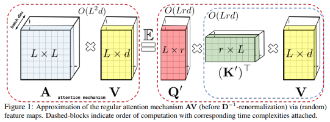

# Attention Mechanisms

An implementation of multiple notable attention mechanisms using TensorFlow 2.3

## [ReZero](https://arxiv.org/pdf/2003.04887.pdf)
```python
from attention_mechanism.utils import ReZero
```

## Reversible Sequence
Part of [Reformer](https://arxiv.org/pdf/2001.04451.pdf)
```python
from attention_mechanism.sequence import ReversibleSequence
```

## [Self-attention](https://papers.nips.cc/paper/7181-attention-is-all-you-need.pdf)
Traditional **Multi head attention** with scaled dot product
```python
from attention_mechanism.attention import MultiHeadAttention
```

Standalone **self-attention** module with linear complexity with respect to sequence length using FAVOR+

</img>

```python
from attention_mechanism.attention import SelfAttention
```

## [Performer](https://arxiv.org/pdf/2009.14794v1.pdf)
The module **PerformerLM** is designed to work with Language Model, and **Performer** can be applied to more general high input dimensions such as images
```python
from attention_mechanism.performer import Performer, PerformerLM
```

## Lambda Layer for [Lambda Networks](https://openreview.net/pdf?id=xTJEN-ggl1b)
```python
from attention_mechanism.lamda_layer import LambdaLayer
```

## [Vision Transformer](https://openreview.net/pdf?id=xTJEN-ggl1b)
```python
from attention_mechanism.vision_transformer import VisionTransformer
```

## [Fast Autoregressive](https://arxiv.org/pdf/2006.16236.pdf)
Incoming...